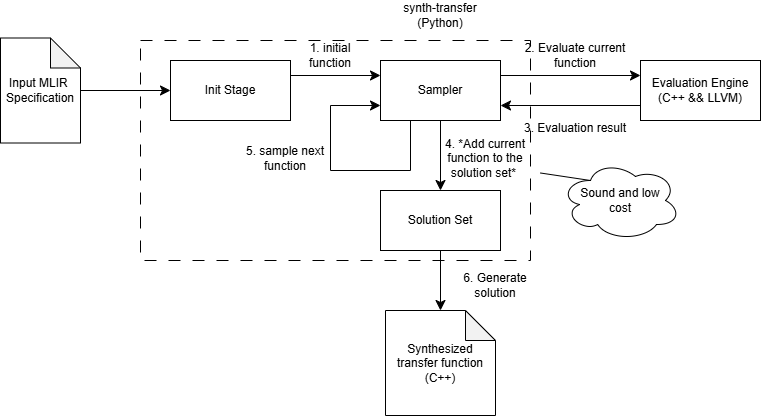

# synth-transfer

This repository is based on xdsl-smt and contains a tool for synthesizing transfer functions in dataflow analysis.

It currently contains the implementation of the synthesizer and several examples files on KnownBits domain.

The diagram below shows the overview of this project.



## Installation

### Build the Eval Engine

#### Set up LLVM

This section tells you how to build LLVM required by the Eval Engine from the source code.

The Eval Engine requires LLVM built with LLVMGold library, so first we need to download the library

`git clone --depth 1 git://sourceware.org/git/binutils-gdb.git binutils`

This line download `binutils` library and we need to use its include path later in LLVM configuration.
(Reminder: No need to build it manually because LLVM would automatically build it since we specify its path)

Suppose its path is `/home/username/GitRepo/binutils/`

Next, clone llvm repo
```bash
git clone https://github.com/llvm/llvm-project.git
cd llvm-project
git checkout 87adafcd2e248fa69d1f776a9e60f95df03b885d
mkdir build
cd build
```
and build the LLVM with following configuration:
```bash
cmake -GNinja -DLLVM_ENABLE_RTTI=ON -DLLVM_ENABLE_EH=ON -DBUILD_SHARED_LIBS=ON \
-DLLVM_BINUTILS_INCDIR=/home/username/GitRepo/binutils/include/ \
-DCMAKE_BUILD_TYPE=Release -DLLVM_TARGETS_TO_BUILD=X86 -DLLVM_ENABLE_ASSERTIONS=ON \
-DLLVM_ENABLE_PROJECTS="llvm;clang;mlir"  ../llvm
```

Please update the second line `-DLLVM_BINUTILS_INCDIR=` with your own path
and don't forget to add `include/` at the end.

Lastly, we should run
```bash
ninja
```
To build LLVM


#### Make the Eval Engine
First install the development packages for llvm and clang.
If they are not availible via your distro's package manager, then build them from source.
So here, suppose you have a working LLVM setup.

```bash
cd xdsl_smt/eval_engine/
mkdir build && cd build
cmake .. && make
cd ../../..
```

If you build LLVM from the source as described in the previous section, you should use following commands to replace
the third line in the previous block.
```bash
cmake .. -D  CMAKE_CXX_COMPILER=/home/username/GitRepo/llvm-project/build/bin/clang++ \
-D CMAKE_PREFIX_PATH=/home/username/GitRepo/llvm-project/build
make
```

### Virtual environment

It is recommended to install the project in a virtual environment.
To create a virtual environment, use the following commands:

```bash
# Create a virtual environment
python -m venv venv
# Activate the virtual environment
source venv/bin/activate
```

### Installation

To install the project, use the following commands:

```bash
# Install the project
pip install .
```

### Development installation

To setup an environment for hacking on xdsl-smt, use the following commands:

```bash
# Install the project in editable mode with dev dependencies
pip install -e '.[dev]'
```


## Tool usage

If you installed this project successfully, now we can start with synthesizing a simple XOR transfer function
on known bits domain.
```bash
synth-transfer ./tests/synth/knownBitsXor.mlir -llvm_build_dir /pathToYourLLVM/llvm-project/build/ -total_rounds 10  -num_programs 10
```
Our argument `-total_rounds` controls how many rounds we run and `-num_programs` specifies how many functions
we synthesize at once in one round.

If it runs successfully, we can observe some output like:
```text
Round	soundness%	precision%	cost
0_0	9.05%	1.65%	2.824	0.415
0_1	100.00%	0.00%	1.965	0.218
0_2	0.11%	0.08%	3.898	0.544
0_3	2.87%	0.27%	3.545	0.502
0_4	43.07%	4.35%	2.283	0.317
0_5	11.90%	5.07%	2.813	0.410
0_6	31.37%	4.11%	2.474	0.351
0_7	19.52%	2.11%	2.694	0.389
0_8	22.22%	4.21%	2.474	0.361
0_9	77.23%	2.11%	2.075	0.256
Used Time: 2.79
```
In the example above, we set both arguments to `10` so for the input XOR specification, we it runs 10 rounds and
samples 10 function in every round.

After running out all rounds, it prints the evaluation of synthesized solution:
```text
last_solution	100.00%	9.53%	1.965	0.218
```
where says the solution is `100%` sound, `9.53%`  precise with the cost as `0.218`

A `tmp.cpp` will be generated as the solution in C++ by combined all solutions in the solution set.
Here is a possible solution function:
```
std::vector<APInt> solution(std::vector<APInt> autogen0,std::vector<APInt> autogen1){
	std::vector<APInt> autogen2=part_solution_0(autogen0,autogen1);
	std::vector<APInt> autogen3=part_solution_1(autogen0,autogen1);
	std::vector<APInt> autogen4=part_solution_2(autogen0,autogen1);
	std::vector<APInt> autogen5=part_solution_3(autogen0,autogen1);
	std::vector<APInt> autogen6=part_solution_4(autogen0,autogen1);
	std::vector<APInt> autogen7=meet(autogen2,autogen3);
	std::vector<APInt> autogen8=meet(autogen7,autogen4);
	std::vector<APInt> autogen9=meet(autogen8,autogen5);
	std::vector<APInt> autogen10=meet(autogen9,autogen6);
	return autogen10;
}
```
We will discuss more information about input and output file in the next section.

You can play with other input specification under `tests/synth`.

## Extending the project with one new abstract domain

To add a new abstract domain you add a new class to `AbstVal.cpp` which inherits from the `AbstVal` base class.
Here's an example called `NewDomain`:

```cpp
class NewDomain : public AbstVal<NewDomain> {
public:
  explicit NewDomain(const std::vector<APInt> &v, unsigned int bw)
      : AbstVal<NewDomain>(v, bw) {}

  const std::string display() const;
  bool isConstant() const;
  const APInt getConstant() const;

  const NewDomain meet(const NewDomain &) const;
  const NewDomain join(const NewDomain &) const;
  const std::vector<unsigned int> toConcrete() const;

  // static constructors
  static NewDomain top(unsigned int bw);
  static NewDomain bottom(unsigned int bw);
  static NewDomain fromConcrete(const APInt &v, unsigned int bw);
  static std::vector<NewDomain> const enumVals(unsigned int bw);
};
```

Here's a list of the methods required for every domain domain:
* `NewDomain(const std::vector<APInt> &v, unsigned int bw)`: this constructor is for synthesiszed transfer functions to create instances of `NewDomain` in the evaluation engine
* `display()`, `isConstant()`, and `getConstant()`: are not used by the evaluation engine (and as such are not strictly required), but they are handy for debugging
* `meet(const NewDomain &)`, and `join(const NewDomain &)`: should follow their respective definitions, in the lattice of the abstract domain
* `toConcrete()`: is the gamma function, which enumerates all of the concrete values represented by the abstract value as a `std::vector<unsigned int>`
* `top(unsigned int bw)`, and `bottom(unsigned int bw)`: should also follow their definitions of full set and empty set
* `fromConcrete(const APInt &v, unsigned int bw)`: takes a concrete value and constructs the abstract value holding only that concrete value
* `enumVals(unsigned int bw)`: enumerates the entire lattice of abstract values as a `std::vector<NewDoman>`

The other last change needed to add a new domain is in `eval.py`.
Add `NewDomain = auto()` to the list of other domains in the enum.

```python
class AbstractDomain(Enum):
    KnownBits = auto()
    ConstantRange = auto()

    def __str__(self) -> str:
        return self.name

```
